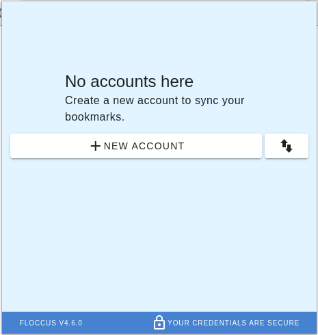
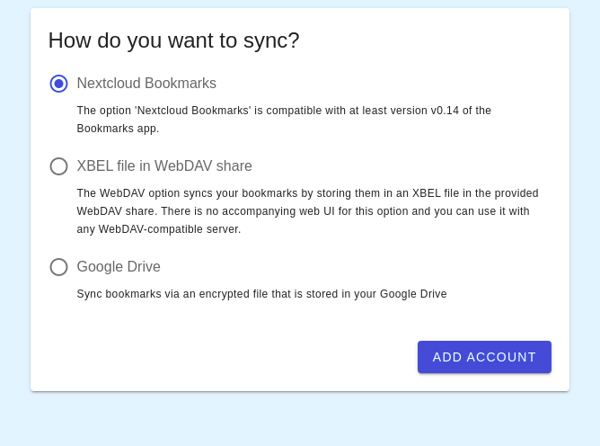
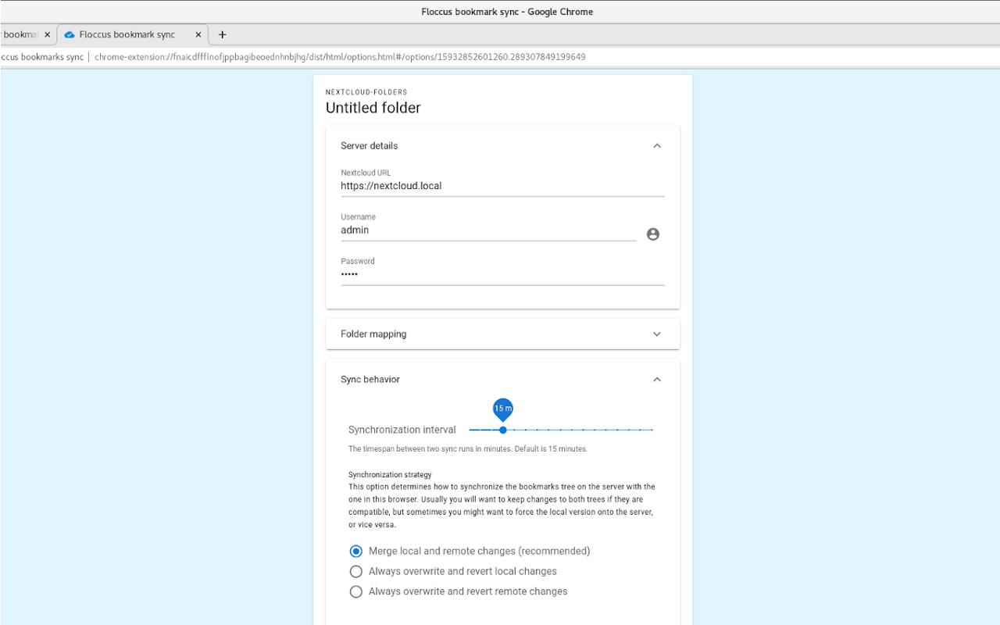
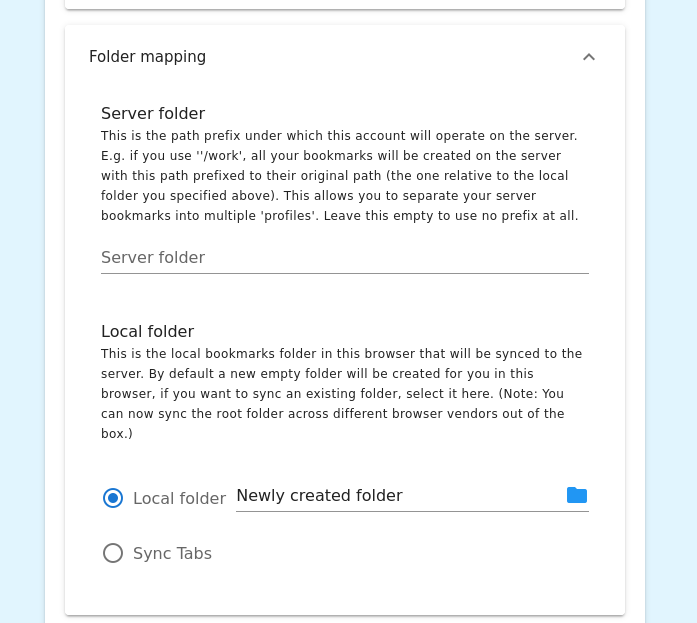
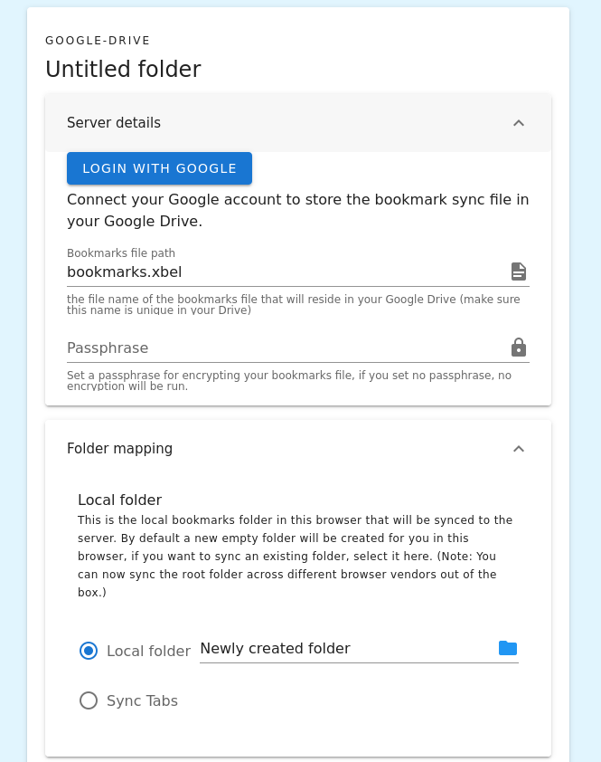
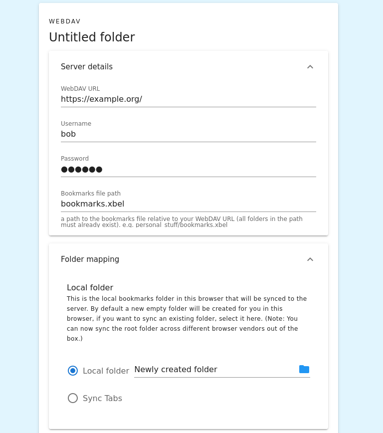
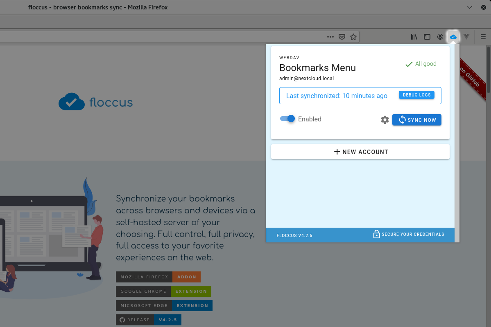

# 0. Prerequisites
You will need a server to sync your bookmarks with.

* If you have a Google Account, you can use Google drive for this. Floccus can even store your bookmarks in an encrypted file in there, so you don't have to worry about your privacy.

* Your sync server can also be a [Nextcloud](https://nextcloud.com) server, which you can host yourself or sign up for an existing instance, with the [Bookmarks App](https://github.com/nextcloud/bookmarks) installed. Syncing with Nextcloud Bookmarks allows you to view your bookmarks with a nice web interface.

* Thirdly, you may use any server that supports [WebDAV](https://en.wikipedia.org/wiki/WebDAV). There is a number of [public services supporting WebDAV access](https://community.cryptomator.org/t/webdav-urls-of-common-cloud-storage-services/75), or you can use a bare [Nextcloud](https://nextcloud.com) server without the Bookmarks app, or you can use [LoFloccus](https://github.com/TCB13/LoFloccus) as a companion app to sync to a file on your local disk.

* Make a backup of your bookmarks. Whenever you are syncing data, you should make regular backups to avoid losing data due to bugs or misconfiguration.

# 1. Install floccus
Floccus is known to work in Chrome, Firefox, Edge, Opera, Vivaldi, Brave and Kiwi. Click on one of the following links to install floccus in your browser.

* [Chrome Webstore](https://chrome.google.com/webstore/detail/floccus/fnaicdffflnofjppbagibeoednhnbjhg) (also applies for Opera, Vivaldi, Brave and Kiwi)
* [Mozilla Addons](https://addons.mozilla.org/en-US/firefox/addon/floccus/)
* [Edge Addons](https://microsoftedge.microsoft.com/addons/detail/gjkddcofhiifldbllobcamllmanombji)

Your browser will ask you to confirm installation, including the permissions necessary for running floccus. Floccus currently requires the following permissions:

| Permission           | Explanation                                                                                                                                                                                                                                                                                                                                                          |
| -------------------- | -------------------------------------------------------------------------------------------------------------------------------------------------------------------------------------------------------------------------------------------------------------------------------------------------------------------------------------------------------------------- |
| storage, unlimitedStorage | Necessary for maintaining a cache and mappings between server and browser bookmarks|
| | |
| alarms               | Necessary for triggering synchronization in regular intervals|
| | |
| bookmarks            | Necessary for creating and reading bookmarks|
| | |
| Unlimited web access | Necessary for accessing your self-hosted server. This cannot be limited, because everybody's server has a different URL. Unfortunately, the way webextensions work currently, floccus also gets access to all the data the browser has collected on those websites. However, floccus makes no use of that data and doesn't in any way collect information about you. |
| | |
| identity             | Necessary for connecting with Google Drive |

# 2. Add a sync account
Once floccus is installed, you will find the floccus icon in your browser toolbar. Clicking on it will reveal the floccus overview panel.

Click on "New Account" to create a new sync account.

# 3. Choose a sync method
Depending on which kind of server you are using, select the appropriate option here.

# 4. Configure account
The following screen allows you to configure your sync account. You can always go back to this screen later.

Depending on which kind of sync method you use, different options are available: If you want to [sync via WebDAV, continue here](#webdav). If you want to [sync via Google Drive, continue here](#google-drive).  Otherwise continue directly below with 'Nextcloud Bookmarks'.

## Nextcloud Bookmarks

First you will need to enter your nextcloud URL. This should be the url that you use to access your nextcloud, e.g. `https://mycloud.provider.com`. Then enter your username and password. If you want to create a separate app password for floccus, click the button next to the user name field, which will direct you to your Nextcloud instance to approve the generation of an app password.

Now, you can configure the folder mapping. You can set one local bookmarks folder and one server folder per account.

The local folder is the folder in your current browser that will be synced. by default, floccus will create a new folder for you, to avoid syncing something that you don't want syned. However, with a click on the folder icon you can select any other folder in your bookmarks. Selecting the topmost "untitled" folder will sync everything.

The server folder defines the folder in your bookmarks app that should contain bookmarks from this sync account. By default floccus stores everything in the topmost folder, but you can change this by entering a path for a subfolder, ie. `/personal` will cause this account to sync bookmarks from the local folder to a folder called `personal` on the server.

You can also opt to sync currently open tabs instead of bookmarks. For this, select the 'Sync tabs' option.

## Google Drive

First you will need to connect floccus with your Google account. After clicking "Login with Google", you will need to sign in and grant floccus access to your Google Drive.

The next option allows you to specify the path to your bookmarks file in your Drive storage. By default floccus will place a file called `bookmarks.xbel` in your topmost folder.

If you'd like to encrypt your data before storing it in your Drive, you can set a passphrase here. If you don't enter anything, it won't be encrypted.

Finally, you can choose which bookmarks folder to sync to that file. By default floccus will create a new folder for you,  to avoid syncing something that you don't want syned. However, with a click on the folder icon you can select any other folder in your bookmarks. Selecting the topmost "untitled" folder will sync everything.

## WebDAV

First you will need to enter the WebDAV URL of your server. Here's a list of [the URLs for the most common public providers](https://community.cryptomator.org/t/webdav-urls-of-common-cloud-storage-services/75). The URL should end with a slash.
Then enter your username and password. 

The next option allows you to specify the path to your bookmarks file in your cloud storage. By default floccus will place a file called `bookmarks.xbel` in your topmost folder.

Finally, you can choose which bookmarks folder to sync to that file. By default floccus will create a new folder for you,  to avoid syncing something that you don't want syned. However, with a click on the folder icon you can select any other folder in your bookmarks. Selecting the topmost "untitled" folder will sync everything.

# 5. Save and sync
Now that you've configured the basic options of your account, you can hit 'Save' and go back to your overview panel, by clicking the floccus icon in your browser toolbar.

It should now show your newly created sync account. Floccus will sync automatically every 15 minutes, and 1 minute after any local change to your bookmarks, but you can also trigger a sync manually by clicking on "SYNC NOW".

That's it. Your bookmarks are now synced with the server of your choosing.
